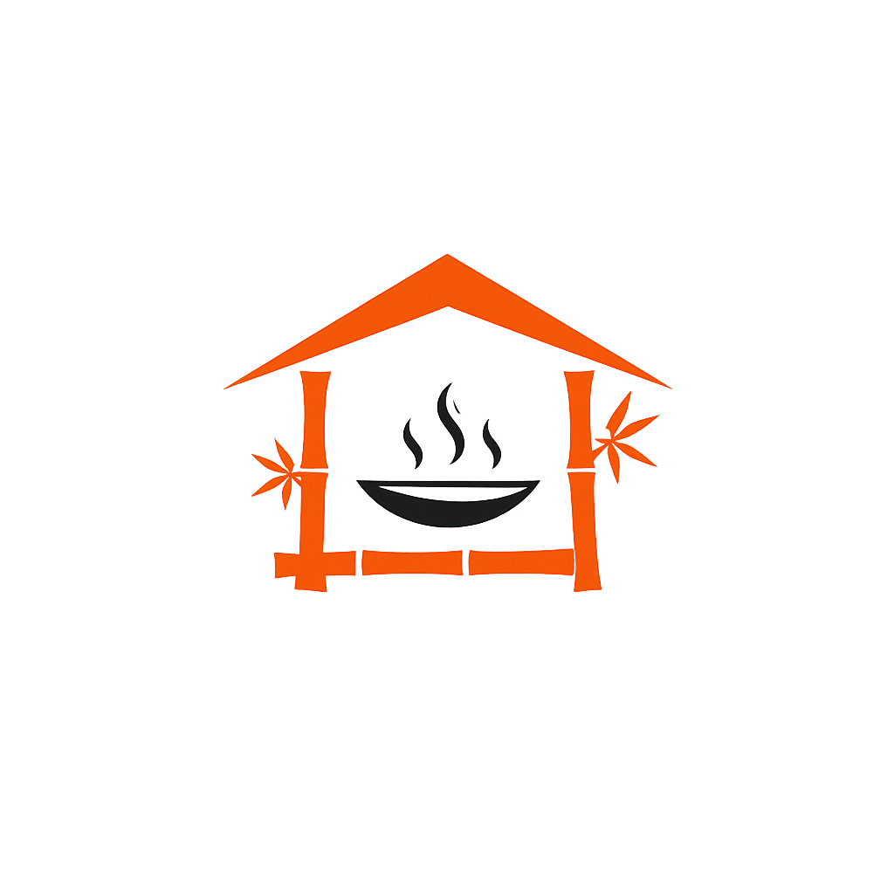

# 🍽️ Tamberma Restaurant Website

<p align="center">
  
</p>

<p align="center">
  <a href="https://github.com/your-org/tamberma-restaurant/actions"></a>
  <a href="https://github.com/your-org/tamberma-restaurant/blob/master/LICENSE"></a>
  <a href="https://github.com/your-org/tamberma-restaurant/releases"></a>
  <a href="https://github.com/your-org/tamberma-restaurant/pulls"></a>
  <a href="https://github.com/your-org/tamberma-restaurant/issues"></a>
  <a href="https://tamberma-demo.vercel.app/"></a>
  <a href="https://nodejs.org/"></a>
  <a href="https://prettier.io/"></a>
  <a href="https://codecov.io/gh/your-org/tamberma-restaurant"></a>
  <a href="https://github.com/your-org/tamberma-restaurant/graphs/contributors"></a>
  <a href="https://twitter.com/tamberma"></a>
  <a href="#"></a>
  <a href="https://github.com/your-org/tamberma-restaurant/commits/master"></a>
</p>

---

# 📑 Table of Contents
- [Demo](#-demo)
- [Brand Identity](#-brand-identity)
- [Features](#-features)
- [Tech Stack](#-tech-stack)
- [Folder Structure](#-folder-structure)
- [Design System](#-design-system)
- [Quick Start](#-quick-start)
- [Advanced Setup](#-advanced-setup)
- [Scripts](#-scripts)
- [Contribution Guidelines](#-contribution-guidelines)
- [FAQ](#-faq)
- [Contact & Support](#-contact--support)
- [Credits](#-credits)
- [License](#-license)

---

## 🚀 Demo

<p align="center">
  <a href="https://tamberma-demo.vercel.app/">
    
  </a>
  <br/>
  <a href="https://tamberma-demo.vercel.app/" target="_blank"><b>🌐 Live Demo</b></a>
</p>

---

## 🏢 Brand Identity
- **Name:** Tamberma Restaurant
- **Concept:** Premium Indian cuisine & craft cocktails
- **Style:** Modern, warm, sophisticated, glassmorphic
- **Colors:** Orange (#e67e22), Earth brown (#8b5a3c), Neutral grays
- **Target:** Urban professionals, foodies, cocktail lovers

---

## ✨ Features

| Feature | Description |
|---------|-------------|
| 🏠 Hero Section | Eye-catching intro with glassmorphism & parallax |
| 🍽️ Menu Viewer | Animated, tabbed, category-based menu |
| 🖼️ Gallery | Scroll-animated, responsive image gallery |
| 📍 Location | Google Maps embed, hours, contact, CTA |
| 💬 Testimonials | Swipeable, animated customer carousel |
| 📱 Mobile-First | Fully responsive, touch-optimized |
| 🎨 Design System | Consistent colors, typography, spacing |
| ⚡ Animations | Framer Motion, CSS, micro-interactions |
| 🧑‍💻 Custom Hooks | useLocalStorage, useResponsive, useScrollAnimation |
| 📝 Accessibility | Semantic HTML, focus states, color contrast |

---

## 🛠️ Tech Stack
- **React 18+** (Vite/CRA compatible)
- **Tailwind CSS 3+**
- **Framer Motion** (animations)
- **Lucide React** (icons)
- **Google Fonts:** Playfair Display, Inter
- **JSDoc** (for utilities/hooks)
- **Vercel** (recommended deployment)

---

## 📁 Folder Structure
```
tamberma-restaurant/
├── public/
│   ├── favicon.ico, index.html, manifest.json
│   └── images/ (menu, gallery, logo, ui)
├── src/
│   ├── components/
│   │   ├── layout/ (Header, Navigation, Footer, Layout)
│   │   ├── sections/ (Hero, About, MenuPreview, Gallery, Contact, Location, Testimonials)
│   │   ├── ui/ (Button, Card, Modal, LoadingSpinner, AnimatedText)
│   │   └── features/ (MenuViewer, ReservationForm, ImageGallery, ContactForm)
│   ├── hooks/ (useScrollAnimation, useResponsive, useLocalStorage)
│   ├── utils/ (animations.js, constants.js, helpers.js)
│   ├── data/ (menuData.js, restaurantInfo.js, galleryData.js)
│   ├── styles/ (globals.css, animations.css)
│   ├── App.jsx, index.js, index.css
├── tailwind.config.js
├── package.json
└── README.md
```

---

## 🎨 Design System
- **Colors:**
  - Primary: `#e67e22`, `#d35400`, `#b7471d`
  - Accent: `#8b5a3c`, `#6b4423`
  - Neutral: `#1a1a1a`, `#2c2c2c`, `#f5f5f5`, `#fafafa`
- **Typography:**
  - Headers: Playfair Display (`font-display`)
  - Body: Inter (`font-sans`)
- **Animations:**
  - Page transitions, hover micro-interactions, scroll reveals
  - Glassmorphism, parallax, loading states
- **Accessibility:**
  - Semantic HTML, focus states, color contrast

---

## ⚡ Quick Start

### 1. **Clone & Install**
```bash
git clone https://github.com/your-org/tamberma-restaurant.git
cd tamberma-restaurant
npm install
```

### 2. **Run Locally**
```bash
npm start
```

### 3. **Build for Production**
```bash
npm run build
```

### 4. **Lint & Format**
```bash
npm run lint
npm run format
```

---

## 🛡️ Advanced Setup

### Environment Variables
- Copy `.env.example` to `.env` and fill in any required values (API keys, etc.)
- Example:
  ```env
  REACT_APP_GOOGLE_MAPS_API_KEY=your-key-here
  REACT_APP_ANALYTICS_ID=your-id-here
  ```

### Deployment
- **Vercel** (recommended):
  - Connect your repo, set environment variables, and deploy.
- **Netlify/Render/Other:**
  - Standard React build/deploy process supported.
- **Static Export:**
  - `npm run build` outputs to `/build` for static hosting.

---

## 📝 Scripts
- `npm start` — Run development server
- `npm run build` — Production build
- `npm run lint` — Lint code
- `npm run format` — Format code (Prettier)

---

## 🧑‍💻 Contribution Guidelines
1. **Fork** the repo & create a feature branch
2. **Follow** the project structure & design system
3. **Write** clean, accessible, and well-documented code
4. **Test** on mobile and desktop
5. **Open a Pull Request** with a clear description

---

## ❓ FAQ

**Q: Can I use this for my own restaurant?**
> Yes, but please credit the original author and do not use for commercial purposes without permission.

**Q: How do I add new menu items or images?**
> Edit the files in `/src/data/menuData.js` and `/public/images/menu/` or `/gallery/`.

**Q: Does it support dark mode?**
> Not by default, but the design system is easy to extend for dark mode.

**Q: How do I deploy to Vercel?**
> Push to GitHub, connect your repo on Vercel, set env vars, and deploy.

---

## 📬 Contact & Support
- **Email:** [hello@tamberma.com](mailto:hello@tamberma.com)
- **Twitter:** [@tamberma](https://twitter.com/tamberma)
- **GitHub Issues:** [Open an issue](https://github.com/your-org/tamberma-restaurant/issues)

---

## 🙏 Credits
- **Design & Development:** [Your Name/Team]
- **Icons:** [Lucide](https://lucide.dev/)
- **Fonts:** [Google Fonts](https://fonts.google.com/)
- **Images:** Unsplash, Pexels, or as credited in `/public/images`

---

## 📣 License
This project is for demonstration and portfolio use. For commercial use, please contact the author.

---

<p align="center">
  <b>Tamberma Restaurant</b> — Where modern design meets unforgettable flavor.<br/>
  <a href="https://tamberma-demo.vercel.app/">🌐 tamberma-demo.vercel.app</a>
</p>

<p align="center">
  <a href="https://twitter.com/tamberma"></a>
  <a href="mailto:hello@tamberma.com"></a>
  <a href="https://github.com/your-org/tamberma-restaurant"></a>
</p>
